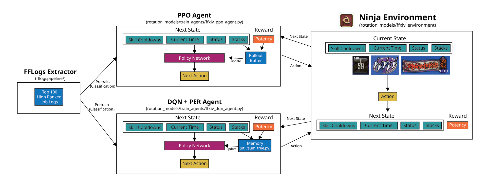
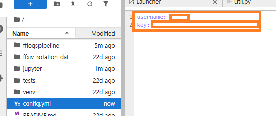

# FFXIV Rotation AI Model Using Reinforcement Learning



# Environment

- Python 3.11
- Tensorflow 3

```
python -m venv venv

# Windows user
$ . venv/Scripts/activate 

# Linux user
$ . venv/bin/activate

# install environment
$ pip install -e .

```

# How to run
```sh
# 1. run dqn agent inference
$ python -m rotation_models.inference --model-type dqn --model-path .\ninja_model_dqn.keras --output-path .\ninja_rotation_log_dqn.csv

# 2. run ppo agent inference 
$ python -m rotation_models.inference --model-type dqn --model-path .\ninja_model_dqn.keras --output-path .\ninja_rotation_log_dqn.csv
```

# How to setup FFLogs credentials for scraping(Optional)

1. Create Fflogs API username and key
2. Save the credentials in config.yml



