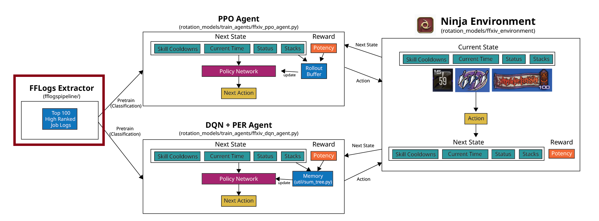

# Gathers logs from FFLogs to Pretrain Reinforcement Models

FFLogs is a ranking site that contains rotation log for high ranked users of each job.

These logs can be used to pretrain the reinforcement models so that the models can learn
priorities players already figured out to reduce training time drastically.

## Pretrain Steps

1) Collect high ranked logs 
2) Load the reinforcement model's policy/q network, and **attach a classification head**
3) Parse the log into action sequences and train the classification model
4) Save the model weights without the head and train the model with reinforcement learning algorithm