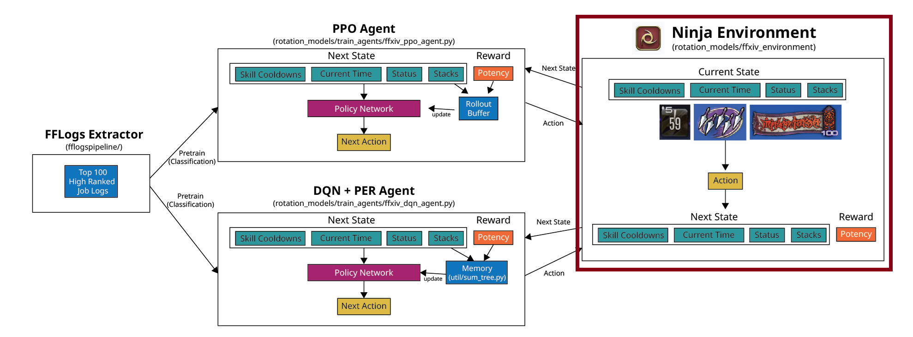
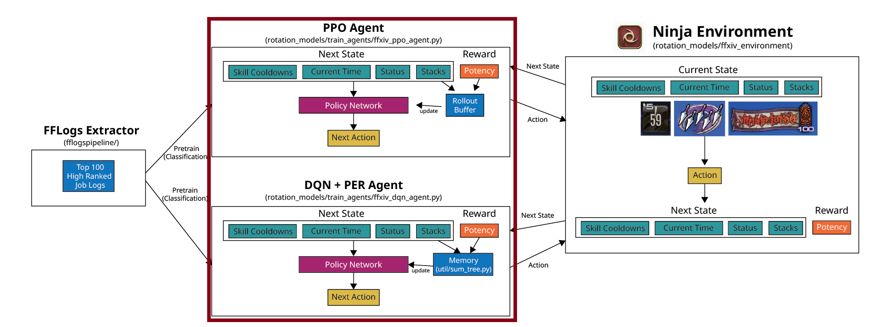

Implements Reinforcement Models and FFXIV Combat Environment needed for training ffxiv ai rotation.

# ffxiv_system

Implements **simulation environment for FFXIV Combat System** that will be implemented by specific ffxiv jobs (currently only `ninja`)

# train_agents

Implements `Proximal Policy Optimization(ffxiv_ppo_agent.py)` and `Duel Q-Learning + Prioritized Experience Replay(ffxiv_dqn_agent.py)` base reinforcement learning models

